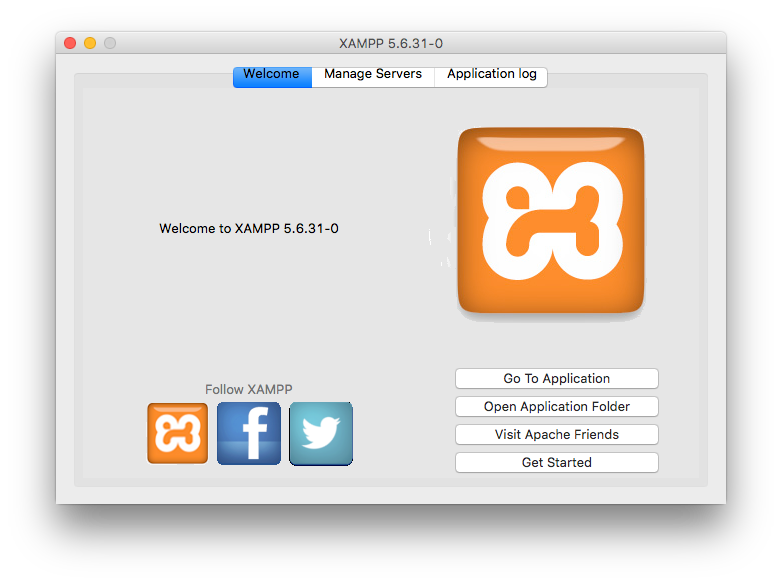

# Biblioteca CETis108

## Descripción
Breve descripción del **proyecto**.

## Requerimientos
Lista de requerimientos de software para el funcionamiento del proyecto.
1. elemento 1
    1. elemento 1.1
2. PHP ~5.6.31 [Descargar](http://php.net/download)
3. elemento 3
- elemento 1
  - elemento dentro de 1
- elemento 2
- elemento 3
> Se recomienda utilizar XAMPP [Ir al sitio oficial de XAMPP](http://apachefriends.org)

## Instalación de requerimientos

Pasos para instalar los requerimientos en case de ser necesario

## Instalación del proyecto
Pasos para instalar el proyecto en PHP con MySQL que tenemos de prestamo de libros.
### Clonar el repositorio
1. Utilizando Git Bash ubicarse en la carpeta de publicación de xampp
```bash
$ cd /c/xampp/htdocs
```
2. Clonar el repositorio
```bash
$ git clone https://github.com/bidkar/a17e18-5ampr-ejercicio-git.git
$ mv a17e18-5ampr-ejercicio-git biblioteca-cetis108
```

## Pruebas
Pasos para probar que el proyecto es funcional.